 

  

  

---

## `JAVA` · `SPRING BOOT` · `REACT` · `SQL` · `GENERATIVE AI`

**Entry-Level Software Engineer | Java Full Stack Development**

## 👋 About Me

I am a **B.E. Electronics and Communication Engineering graduate** focused on building my career in **Java Full Stack Development**.

I have hands-on internship and project exposure across **Java, SQL, web development, and Generative AI**, and I am currently strengthening my skills in **Spring Boot, React, REST APIs, databases, and modern application development**.

I enjoy turning requirements into clean, practical applications and continuously improving my understanding of software engineering.

 

| Education | Primary Stack | Development Focus | Additional Strength |
| :--- | :--- | :--- | :--- |
| **B.E. ECE · 8.3 / 10** | **Java · Spring Boot · React** | **REST APIs · SQL · Full Stack** | **Generative AI · Problem Solving** |
| 2022 – 2026 | Backend + Frontend | Application Development | Continuous Learning |

---

## 🧠 Technical Stack

### ☕ Java Ecosystem

  

  

### ⚛️ Frontend

  

### 🐍 Programming

  

### 🗄️ Data

  

### 🛠️ Development Tools

 

| Area | Skills |
| :--- | :--- |
| **Backend** | REST APIs · JDBC · Spring Data JPA |
| **Core Java** | OOP · Collections · Exception Handling |
| **AI** | Generative AI |
| **Soft Skills** | Problem Solving · Communication · Teamwork · Adaptability · Quick Learning |

---

## 💼 Experience

<b>☕ Java Intern · Navodita Infotech</b> — Dec 2025 – Jan 2026

 

- Developed a **Java-based online quiz application** with separate Student and Admin login modules.
- Implemented **authentication, quiz management, and instant result generation**.
- Debugged the application and performed **basic unit testing**.

**Focus:** `Java` · `OOP` · `Authentication` · `Application Development` · `Testing`

 

<b>🤖 Generative AI Intern · NASSCOM FutureSkills Prime</b> — Jul 2025 – Sep 2025

 

- Completed practical training in **Generative AI**.
- Explored practical AI concepts and application use cases.
- Worked through **AI-focused training exercises** as part of the program.

**Focus:** `Generative AI` · `AI Applications` · `Practical Training`

---

## 🚀 Featured Projects

### 01 · Job Matching Portal

<b>Java Application · Skill-Based Matching</b>

 

**Technology:** `Java`

Developed a skill-based portal matching candidates with relevant job opportunities.

- Implemented candidate and job data handling using **Java**.
- Developed matching logic based on candidate skills.
- Structured application functionality around candidate/job relationships.

 

### 02 · Sales Forecasting & Time Series Analysis

<b>SQL Analytics · Monthly Sales Forecasting</b>

 

**Technology:** `MySQL` · `SQL`

Analyzed monthly sales data and created a basic next-month sales forecasting workflow.

- Used **JOINs, aggregates, subqueries, and window functions**.
- Applied **moving averages** to monthly sales data.
- Calculated **month-over-month growth**.
- Created a basic **next-month sales forecast**.

---

## 🏆 Certifications

| Certification | Provider |
| :--- | :---: |
| **Java Programming** | Coursera |
| **Python Programming** | GUVI |
| **HTML & CSS, JavaScript** | GUVI |
| **SQL** | Simplilearn |

---

## 🎓 Education

### B.E. — Electronics and Communication Engineering

**GRT Institute of Engineering and Technology**

`2022 – 2026` · **CGPA: 8.3 / 10**

---

## 📊 GitHub Analytics

 

---

## 🟣 Contribution Activity

---

## 🌐 Languages

---

## 🎯 Current Focus

`Java Full Stack` · `Spring Boot` · `React` · `REST APIs` · `SQL` · `Generative AI`

 

**Open to entry-level opportunities in Java, full-stack development, and software engineering roles.**

 

<table>
<tr>
<td align="center" width="50%"></td>
<td align="center" width="50%"></td>
</tr>
</table>

 

 

Java • Spring Boot • React • SQL • Continuous Learning

